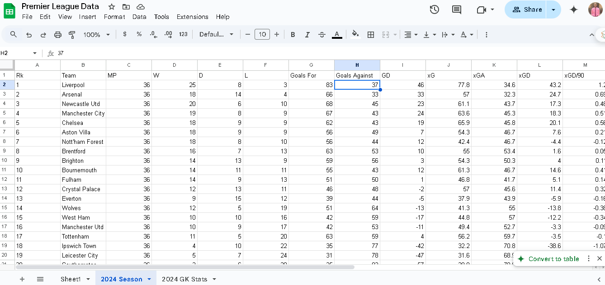
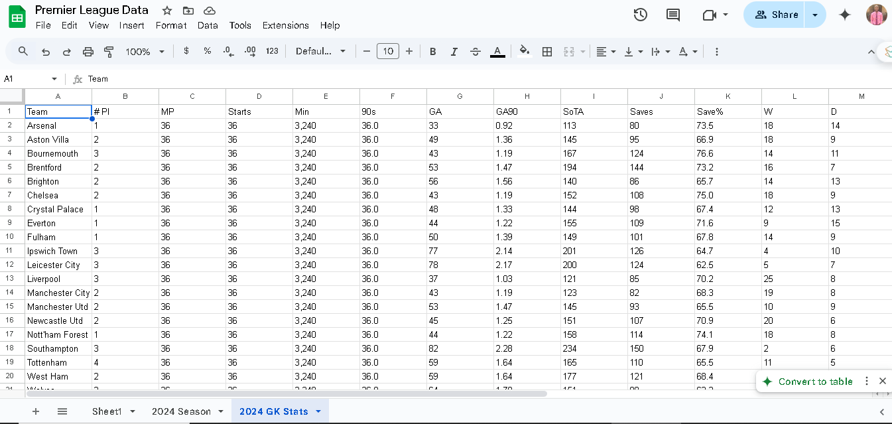

# Oluwafemi-Olajide-Web-Scraping

# Premier League Web Scraping and Data Processing Pipeline




---

## Overview

This project is a **web scraping and data processing pipeline** designed to scrape Premier League 2024/2025 season data, clean and process it, and then upload the cleaned data to Google Sheets. The pipeline extracts final league tables and goalkeeper statistics and automatically updates a Google Sheet for easy sharing and analysis.

---

## Project Structure

```
premier_league_scraper/
│
├── credentials/                   # Google API credentials (keep private)
├── src/
│   ├── cleaner.py                # Data cleaning functions
│   ├── scraper.py                # Web scraping functions
│   ├── uploader.py               # Uploading and pipeline orchestration with logging
│   ├── __init__.py               # Package init
│   ├── premier_league_stats.html # Sample downloaded HTML page (scraped source)
│   ├── upload.log                # Log file for upload activity
│   └── __pycache__/              # Cache files
├── EPL_Table.png                 # Screenshot of league table output
├── Goal_Keeping_Stats.png        # Screenshot of goalkeeper stats output
├── fetch_html.py             	 # Scraped the premier_league_stats.html data
├── requirements.txt              # Required Python packages
└── .gitignore                   # Git ignore file
```

---

## Features

- **Scraping:** Extracts 2024/2025 Premier League data such as league tables and goalkeeper stats from HTML sources.
- **Data Cleaning:** Cleans raw scraped data, removes irrelevant info, and formats the data properly.
- **Google Sheets Integration:** Uploads cleaned data into Google Sheets, replacing old worksheets and adding updated data.
- **Logging:** Logs pipeline activities for monitoring success or issues.
- **Error Handling:** Robust error handling for missing files, API errors, and spreadsheet access issues.

---

## Installation & Setup

1. **Clone the repository:**
   ```bash
   git clone https://github.com/Data-Epic/Oluwafemi-Olajide-Web-Scraping.git
   cd premier_league_scraper
   ```

2. **Create and activate a Python virtual environment:**
   ```bash
   python -m venv venv
   venv\Scripts\activate  # Windows
   # source venv/bin/activate  # macOS/Linux
   ```

3. **Install dependencies:**
   ```bash
   pip install -r requirements.txt
   ```

4. **Google Sheets API Credentials:**
   - Follow [GSpread Documentation](https://gspread.readthedocs.io/en/latest/oauth2.html) to create and download your `google_sheets_credentials.json`.
   - Place the credentials file in the `credentials/` folder.

5. **Prepare the source HTML file:**
   - Save the Premier League HTML data to `src/premier_league_stats.html` or update the path in the script accordingly.

---

## Running the Pipeline

From the root folder, run the uploader script which acts as the pipeline controller:

```bash
python src/uploader.py
```

This will:

- Scrape and clean data from the local HTML file.
- Upload the cleaned league table to the Google Sheet in the worksheet "2024 Season".
- Upload goalkeeper stats to the worksheet "2024 GK Stats".
- Log all operations to `src/upload.log`.

---

## Logging

The pipeline logs important steps and errors to `src/upload.log` for easy debugging and monitoring. Example log entries:

```
2025-05-23 09:51:20,978 [INFO] Processing league stats...
2025-05-23 09:51:35,800 [INFO] Deleted old worksheet: 2024 Season
2025-05-23 09:51:36,730 [INFO] Uploaded 20 rows to worksheet '2024 Season'
```

---

## Notes

- Ensure your Google Sheets spreadsheet is shared with the service account email from your credentials.
- Respect the target website's robots.txt and scraping policies.
- All scraping is currently done on a saved local HTML file for reliability and repeatability.

---

